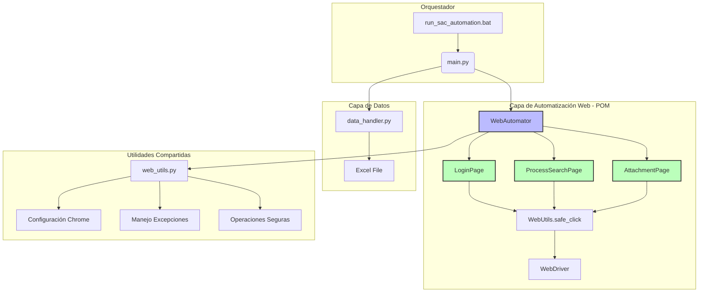
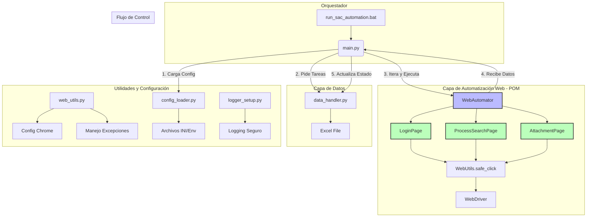

# Arquitectura del Sistema: SAC Automation

## Componentes Clave

- **main.py (Orquestador)**: Punto de entrada que coordina la inicialización de componentes y el flujo de ejecución principal, manejando la configuración general y la inyección de dependencias.
- **core/data_handler.py (Capa de Acceso a Datos)**: Abstrae toda la interacción con archivos Excel, responsable de leer la cola de trabajo, obtener credenciales y actualizar el estado de procesos. Implementa separación de responsabilidades al aislar la lógica de I/O de datos del resto del sistema.
- **core/web_automator.py (Capa de Automatización Web)**: Encapsula la lógica completa de Selenium para interactuar con el sistema SAC, incluyendo navegación, login, búsqueda de procesos y carga de anexos. Implementa completamente el patrón Page Object Model (POM) con clases especializadas para cada página/componente.
- **core/web_utils.py (Utilidades Web)**: Módulo de utilidades centralizadas que proporciona métodos reutilizables para operaciones comunes de Selenium, manejo de excepciones y configuración del navegador.
- **core/config_loader.py (Gestor de Configuración)**: Centraliza la carga de configuración desde múltiples fuentes (Excel, archivos INI, variables de entorno), proporcionando una interfaz unificada para acceder a rutas, URLs y credenciales.
- **core/logger_setup.py (Configuración de Logging)**: Establece el sistema de logging seguro con sanitización de datos sensibles, asegurando trazabilidad completa sin comprometer información confidencial.

## Patrón de Diseño: Page Object Model (POM)

### Descripción del Patrón
El Page Object Model es un patrón de diseño esencial para la automatización web que promueve la separación de responsabilidades y mejora la mantenibilidad del código. En el contexto de SAC Automation, este patrón será implementado para estructurar la interacción con el sistema SAC de manera más robusta y escalable.

### Estructura Propuesta para Clases Page Object
- **LoginPage**: Gestiona la autenticación en el sistema SAC, encapsulando métodos para selección de dominio, ingreso de credenciales y validación de login exitoso.
- **ProcessSearchPage**: Maneja la búsqueda y filtrado de procesos, incluyendo la navegación a la página de administración y la interacción con campos de búsqueda.
- **AttachmentPage**: Controla la carga de anexos, desde la apertura del modal hasta la selección y subida de archivos, con validación de estados de carga.

### Beneficios del Patrón POM
- **Reutilización de Código**: Los métodos de página pueden ser reutilizados en múltiples escenarios de prueba o automatización.
- **Facilidad de Mantenimiento**: Cambios en la UI del sistema SAC solo requieren actualizaciones en las clases Page Object correspondientes, sin afectar la lógica de negocio.
- **Reducción de Duplicación**: Elimina código repetitivo para interacciones comunes con elementos web.
- **Mejor Testabilidad**: Permite pruebas unitarias de componentes individuales sin necesidad de ejecutar el flujo completo.

### Implementación Completada - Enero 2025
El patrón Page Object Model ha sido completamente implementado en la versión 2.0.0 del sistema:

#### Clases Page Object Implementadas
- **BasePage**: Clase base con métodos comunes reutilizables (safe_click, safe_send_keys, wait_for_element).
- **LoginPage**: Gestiona autenticación completa en SAC con manejo robusto de excepciones.
- **ProcessSearchPage**: Maneja navegación a administración y búsqueda filtrada de procesos.
- **AttachmentPage**: Controla todo el flujo de carga de anexos, desde inserción hasta guardado.

#### Beneficios Alcanzados
- **Mantenibilidad Mejorada**: Cambios en selectores XPath ahora requieren modificaciones solo en clases Page Object específicas.
- **Reutilización de Código**: Los métodos de página pueden reutilizarse en múltiples escenarios sin duplicación.
- **Facilidad de Testing**: Cada Page Object puede probarse unitariamente con mocks del driver.
- **Reducción de Duplicación**: Eliminación completa de código repetitivo para interacciones web.

#### Integración con Arquitectura
- **WebUtils**: Módulo de utilidades centralizadas para operaciones comunes de Selenium.
- **WebAutomator**: Clase coordinadora que instancia y orquesta los Page Objects.
- **Compatibilidad Legacy**: Métodos antiguos marcados como deprecated pero mantenidos para transición.

## Flujo de Datos

1. **Inicialización**: main.py carga configuración via config_loader.py y establece logging seguro.
2. **Lectura de Datos**: data_handler.py lee tareas pendientes desde Excel, filtrando por fecha, medio y estado.
3. **Procesamiento Iterativo**:
   - main.py itera sobre tareas, pasando datos a web_automator.py.
   - web_automator.py ejecuta login (si necesario), búsqueda de proceso y carga de anexo.
   - Resultados se devuelven a main.py para actualización de estado.
4. **Actualización de Estado**: data_handler.py marca tareas como completadas o con error en Excel.
5. **Limpieza**: web_automator.py cierra sesión y navegador; main.py libera recursos.

## Estrategia de Excepciones

- **TimeoutException**: Manejada con reintentos automáticos en operaciones web, con backoff exponencial.
- **StaleElementReferenceException**: Implementada lógica de reintento en _send_keys para manejar DOM dinámico.
- **ElementNotInteractableException**: Verificaciones de visibilidad y clickeabilidad antes de interacciones.
- **ElementClickInterceptedException**: Detección y manejo de overlays/modales que bloquean clics.
- **FileNotFoundError**: Validación previa de existencia de archivos anexo antes de carga.
- **ValueError**: Validación de configuración y datos de entrada en puntos de entrada.

## Decisiones Técnicas Críticas

### Uso de Selenium para Automatización Web
**Justificación**: Selenium proporciona una API madura y ampliamente soportada para automatización de navegadores, con capacidades avanzadas para manejo de JavaScript, waits explícitos y compatibilidad cross-browser. Las ventajas incluyen:
- Soporte nativo para interacciones complejas con aplicaciones web modernas.
- Comunidad activa y ecosistema rico de herramientas complementarias.
- Capacidad para ejecutar en modo headless para entornos de CI/CD.

**Consideraciones de Mantenimiento**: Los selectores XPath pueden volverse frágiles con cambios en la UI; se mitiga con estrategias de localización robusta y el patrón POM planificado.

### Arquitectura Modular con Separación de Responsabilidades
**Justificación**: La estructura monolítica original violaba el principio de responsabilidad única, haciendo el código difícil de mantener y probar. La separación en módulos especializados (data_handler, web_automator, config_loader) permite:
- Desarrollo paralelo por diferentes equipos.
- Pruebas unitarias independientes de cada componente.
- Reutilización de módulos en otros proyectos de automatización.

### Configuración Centralizada y Segura
**Justificación**: Centralizar la configuración en config_loader.py permite gestión unificada de entornos (desarrollo, staging, producción) y facilita la integración con sistemas de secrets management. La sanitización de logs previene exposición accidental de credenciales.

### Manejo Robusto de Excepciones con Reintento
**Justificación**: Las aplicaciones web son inherentemente inestables debido a latencias de red, actualizaciones dinámicas del DOM y cambios en el backend. La estrategia de reintento con backoff exponencial asegura resiliencia sin sobrecargar los sistemas objetivo, mientras que el logging detallado facilita la depuración de fallos intermitentes.

### 1.2. Diagrama de la Arquitectura Actual - Versión 2.0.0 con POM

### 1.3. Mejoras Implementadas en la Arquitectura Actual

- **Alta Cohesión y Bajo Acoplamiento:** Implementación completa del patrón POM con separación clara de responsabilidades. Cada Page Object maneja una página/componente específico sin afectar otros módulos.
- **Testabilidad Mejorada:** Los Page Objects pueden probarse unitariamente con mocks del WebDriver. La lógica de negocio se puede probar sin navegador real.
- **Escalabilidad Aumentada:** Añadir nuevas funcionalidades requiere solo crear nuevos Page Objects o extender los existentes, sin modificar el código principal.
- **Reutilización Completa:** Los Page Objects y utilidades pueden reutilizarse en otros proyectos de automatización web.

## 2. Arquitectura Implementada (Versión 2.0.0)

La arquitectura modular y en capas ha sido completamente implementada, con el patrón Page Object Model como núcleo de la automatización web.

### 2.1. Descripción de Módulos Implementados

- **`main.py` (Orquestador):**
  - Punto de entrada de la aplicación completamente funcional.
  - Inicializa componentes y orquesta el flujo principal de automatización.
  - Gestiona configuración e inyección de dependencias.

- **`core/` (Directorio del núcleo implementado):**
  - **`data_handler.py` (Capa de Acceso a Datos):**
    - Abstracción completa de interacción con Excel implementada.
    - Lee cola de trabajo, obtiene credenciales, actualiza estados de procesos.
    - Aislado completamente de lógica web y Selenium.
  - **`web_automator.py` (Capa de Automatización Web - POM):**
    - Implementa completamente el patrón Page Object Model.
    - Contiene clases LoginPage, ProcessSearchPage, AttachmentPage.
    - Gestiona navegador, login, navegación, búsqueda y carga de archivos.
    - Recibe datos como parámetros, sin conocimiento de Excel.
  - **`web_utils.py` (Utilidades Web):**
    - Utilidades centralizadas para operaciones Selenium comunes.
    - Métodos safe_click, safe_send_keys con manejo de excepciones.
    - Configuración unificada de Chrome Driver.
  - **`config_loader.py` (Gestor de Configuración):**
    - Centraliza carga de configuración desde múltiples fuentes.
    - Soporta archivos INI, variables de entorno y Excel.
  - **`logger_setup.py` (Configuración de Logging):**
    - Logging seguro con sanitización de datos sensibles implementado.

### 2.2. Diagrama de la Arquitectura Implementada

### 2.3. Ventajas de la Arquitectura Implementada

- **Alta Cohesión y Bajo Acoplamiento:** Arquitectura completamente modular con patrón POM implementado. Cada Page Object maneja responsabilidades específicas sin interferencias.
- **Testabilidad Avanzada:** Pruebas unitarias posibles para cada componente. Page Objects pueden mockearse, data_handler puede probarse con archivos Excel de prueba, sin navegadores reales.
- **Escalabilidad y Mantenibilidad:** Nuevas funcionalidades requieren solo extensiones de Page Objects existentes. Cambios en UI afectan únicamente clases específicas.
- **Reutilización Completa:** Page Objects y utilidades pueden reutilizarse en otros proyectos. WebUtils proporciona base sólida para futuras automatizaciones web.